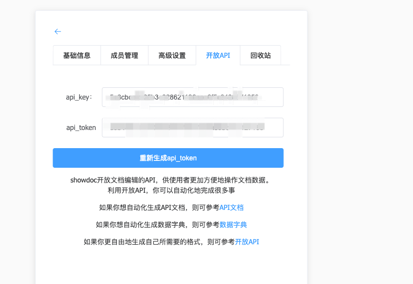
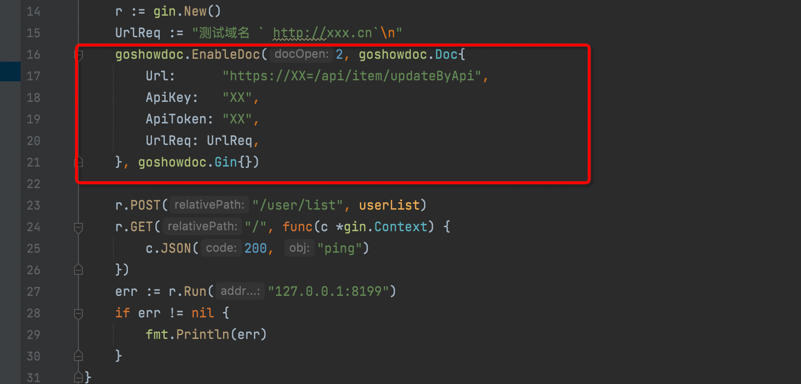
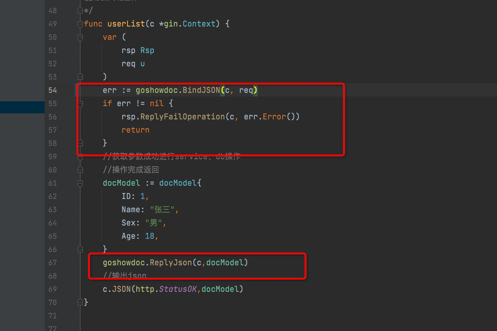
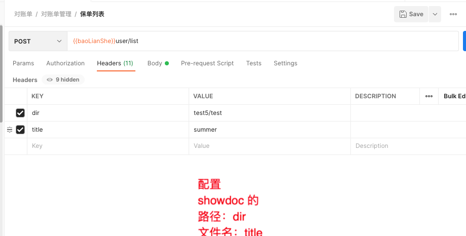
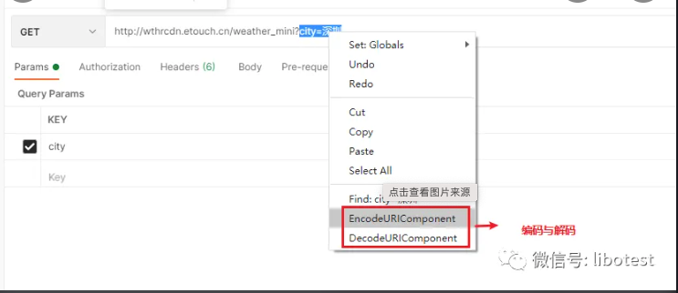

# goshowdoc

```
 go get github.com/qinaction/goshowdoc
```

1. 第一步获取：
   在showdoc文档中获取apikey、apitoken、showdocurl写入配置文件中
   

2. 在路由层添加前置拦截获取请求体
   

3. 在控制层post请使用goshowdoc.BindJSON()、goshowdoc.ReplyJson()
   

4. 通过postman生成文档
   

5. 登录showDoc查看文档

6. 如果指定的showDoc的路径和标题为中文需要通过postman进行转码：
      postman右键有个EncodeUrlComponent:
  

7. 案例查看：test/doc_test.go
 
   
    